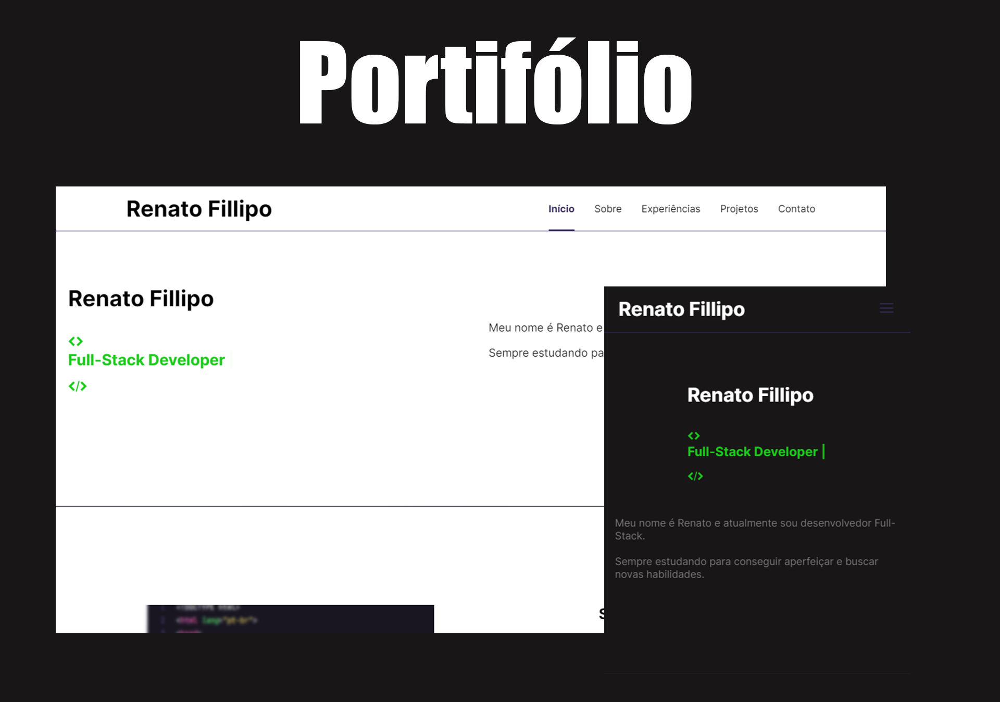

<h1 align="center"> Porfitólio Renato Fillipo </h1>

Este foi um projeto onde estão minhas informações e também os projetos que foram desenvolvidos. 

  <a href="#-tecnologias">Tecnologias</a>&nbsp;&nbsp;&nbsp;|&nbsp;&nbsp;&nbsp;
  <a href="#-projeto">Projeto</a>&nbsp;&nbsp;&nbsp;|&nbsp;&nbsp;&nbsp;
  <a href="#memo-licença">Licença</a>

  

 

  

## 🚀 Tecnologias

Esse projeto foi desenvolvido com as seguintes tecnologias:

- HTML e CSS
- JavaScript
- Git e Github

## 💻 Projeto

Este é um portifólio onde contem informações e projetos.

- [Visite o projeto online](https://renatofillipo0922.github.io/portifoliorenatofillipo)

## :memo: Licença

Esse projeto está sob a licença MIT.
